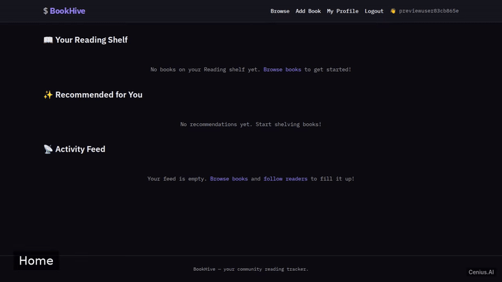
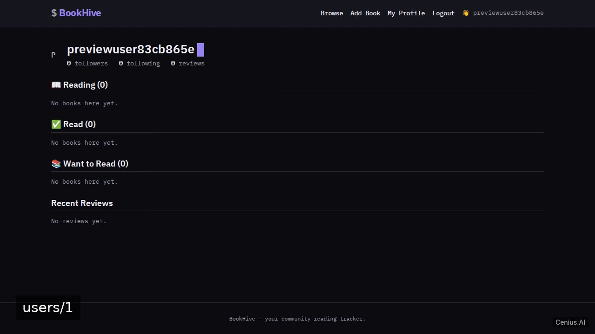
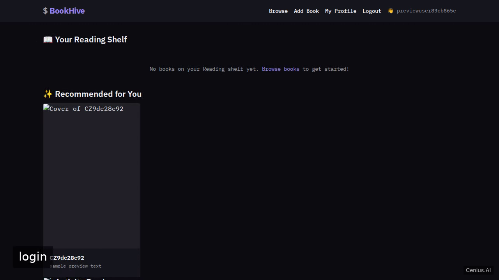

# BookHive — complete Flask book social network example app

Clone it. Run it. Own it. **BookHive** is a complete, Apache-2.0-licensed book social network app in Flask — full source, demo data included. A full-stack reading-community web app built with Python Flask, SQLite via SQLAlchemy, and Jinja2 server-rendered templates. Self-host BookHive on your own infrastructure, or open it on [cenius.ai](https://cenius.ai/marketplace/p/bookhive?ref=gh&utm_campaign=bookhive-flask) to request changes and get a BookHive fresh build.


[](LICENSE)  [](https://cenius.ai)

[](https://cenius.ai/marketplace/p/bookhive?ref=gh&utm_campaign=bookhive-flask)

> **▶ [Open & edit in cenius.ai](https://cenius.ai/marketplace/p/bookhive?ref=gh&utm_campaign=bookhive-flask)** — one click to an editable workspace: describe changes in plain English, get an instant preview, one-click deploy and host. Modifications made on the platform come with full rebrand & relicense rights.

_Local clone? See [Quick start](#quick-start) below. cenius.ai is the zero-setup path._

## Demo



▶ **[Watch the full demo video](https://cenius.ai/marketplace/p/bookhive?ref=gh&utm_campaign=bookhive-flask)** — the complete walkthrough, playing on the project's cenius.ai page · [MP4 file](.github/media/demo.mp4)

## Screenshots

  

## Usage guide

Once the application is running, open your browser to `http://127.0.0.1:5000`.

### Web Interface

#### Public Home Page

Visiting `/` without logging in shows the six top-rated books on the platform.

#### Registration

Navigate to `/register`. Provide a username (≥2 characters), email, and password (≥6 characters). After successful registration you are redirected to the login page.

#### Login / Logout

Go to `/login` and enter your email and password. Once authenticated you can access all member features. Click **Logout** (or visit `/logout`) to end your session.

#### Books

- **Browse books** at `/books`. The page supports:
  - Full‑text search by title, author, or description (`?q=` query parameter).
  - Filtering by genre (`?genre=`).
  - Sorting by title, publication year, or average rating (`?sort=title|year|rating`).
  - Pagination (`?page=`).

- **Add a book** at `/books/add` (requires login). Fill in title, author, genre, publication year, cover image URL, and description.

- **View a book** at `/books/<id>`. The page shows:
  - Book details.
  - Average rating (if any).
  - The currently logged‑in user’s shelf status (Want to Read, Reading, Read) and a dropdown to change it.
  - All reviews, each with an option for the author (or an admin) to edit or delete.

- **Edit a book** at `/books/<id>/edit` (admins only).
- **Delete a book** via POST to `/books/<id>/delete` (admins only).

#### Reviews

_Full guide: [`USAGE.md`](USAGE.md)_

## Features

- User registration and authentication
- Book management
- Review system
- Shelf management
- Browse and search books
- Social follow and activity feed
- User profile
- REST-ish JSON API
- Seed data
- Admin functionality

## Quick start

```bash
./install.sh   # installs dependencies + seeds demo data
```

See [`INSTALL.md`](INSTALL.md) for full setup and usage instructions.

## Architecture

Flask project, delivered as a complete runnable codebase (31 files). Top-level layout: `static/`, `templates/`. `install.sh` takes care of packages and initial data in a single pass; nothing else is required before launching. Step-by-step setup guide: [`INSTALL.md`](INSTALL.md).

## FAQ

### How do I run BookHive on my own server?

Grab the repo and run `./install.sh` — it handles packages and seed data in one go. After that, [`INSTALL.md`](INSTALL.md) walks you through starting the server. No external accounts required.

### Is it possible to white-label BookHive for a client?

Yes. You can edit the source directly under the MIT license, or [remix it on cenius.ai](https://cenius.ai/marketplace/p/bookhive?ref=gh&utm_campaign=bookhive-flask) — the platform route grants full rebrand and relicense rights over your derivative.

### What is BookHive built with?

Flask. The full source in this repository is exactly what the app runs. Highlights include shelf management.

### Can I change BookHive without writing code?

Yes — [load it on cenius.ai](https://cenius.ai/marketplace/p/bookhive?ref=gh&utm_campaign=bookhive-flask), describe the change in plain English, and you get back a fresh build with your modification applied.

### Can I use BookHive in a commercial project?

Confirmed free for commercial use — MIT terms let you incorporate, resell, or ship it in any product. [LICENSE](LICENSE).

## License & rebranding

Released under the [Apache License 2.0](LICENSE) (© 2026 Cenius AI) — free for personal and commercial use. The Cenius name/logo are trademarks (see NOTICE).

**Need a customized version?** [Remix this app on cenius.ai](https://cenius.ai/marketplace/p/bookhive?ref=gh&utm_campaign=bookhive-flask) — modifications made on the platform come with **full rebrand & relicense rights** over your derivative.

## Built with cenius.ai

This entire application — code, design, seeded demo data — was generated on **[cenius.ai](https://cenius.ai)** from a plain-English description.

- 🚀 [Build your own app on cenius.ai](https://cenius.ai)
- 🎛️ [Remix BookHive on the marketplace](https://cenius.ai/marketplace/p/bookhive?ref=gh&utm_campaign=bookhive-flask) — open it in a workspace, prompt for changes, and ship your own version.

More open-source apps: [the Cenius-ai catalog](https://github.com/Cenius-ai) · [showcase index](https://github.com/Cenius-ai/showcase)
